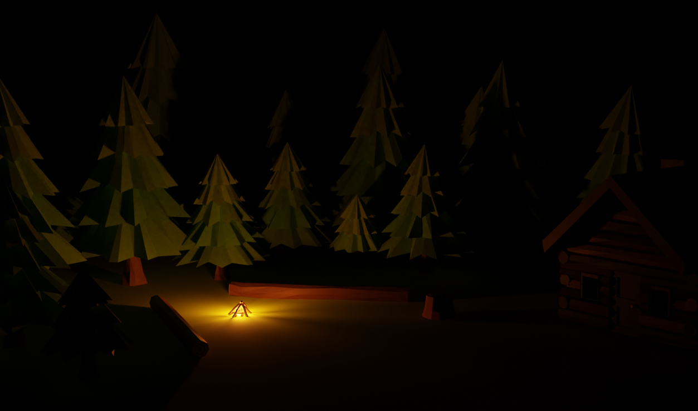

<h1 align='center'> Computação Gráfica </h1>
<p align='center'> Este repositório contém os três projetos práticos da disciplina de Computação Gráfica desenvolvidos em C através da API gráfica OpenGL. <br><br>
Além disso, cada pasta deste repositório corresponde a um projeto, sendo assim, em todos os diretórios encontram-se arquivos <code>Readme.md</code> com mais informações sobre cada um deles.</p>


## :mount_fuji: Trabalho Final - Snowland

Intitulamos **Snowland** o nosso Projeto Final da disciplina de Computação Gráfica cujo objetivo foi criar uma cena com objetos 3D por meio da API gráfica OpenGL na qual contém interações com o teclado e mouse, animações através de transformações geométricas, configurações de iluminação, remoção de superfícies ocultas, entre outros requisitos.
Para tanto, foi utilizada a Linguagem de Programação C em conjunto à API gráfica OpenGL e para criar os objetos 3D foi utilizado o software [Blender](https://www.blender.org/) na versão 3.5 LTS.

### :evergreen_tree: Como executar

1. Clone este repositório
    ```bash
    git clone https://github.com/GustavoMartinx/Computer-Graphics.git
    ```

2. Acesse o diretório ``montanha com obj e mtl`` 
    ```bash
    cd 'montanha com obj e mtl'
    ```

3. Instale as bibliotecas necessárias
    ```bash
    sudo apt-get install libglew-dev libsoil-dev
    ```

4. Compile o código-fonte em ``C`` e execute
    ```bash
    gcc -o app main.c glm.c glmdraw.c util/readtex.c util/shaderutil.c util/trackball.c -lGLU -lGL -lglut -lGLEW -lm -lSOIL && ./app
    ```


### :snowflake: Funcionalidades

#### Controle da câmera
- `w` `a` `s` `d` movimentam a câmera nos eixos X e Z;
- `[espaço]` e `q` movimentam a câmera no eixo Y;
- com `CapsLock` ativo, as telas acima exercem as mesmas funções, porém com maior velocidade;
- com o `mouseRight` é possível controlar a direção na qual a câmera aponta;
- `c` move a câmera para uma posição pré configurada próxima à cabana;
- `u` move a câmera para a posição padrão de visão.
- `o` debug snapshot: fornece as coordenadas da posição da câmera e sua direção de visão.

#### Animações Geométricas
- `p` abre e fecha a porta da cabana;
- `b` cria uma bola de neve e a faz cair montanha a baixo;
- quando tens `fe`, moves montanhas com `i` `j` `k` `l`;
- `lu` ativa as configurações de iluminação;
- **neva** continuamente através de um sistema de partículas.

<br>

## :mount_fuji: Preview dos Objetos 3D Criados





## :sweat_drops: Preview no OpenGL
<!--  -->


<!-- ====================================================================-->


<br>

## Trabalho 2 - Viewing 3D
Este trabalho consiste em dividir a janela do OpenGL quatro viewports, onde três projeções são ortogonais e uma (inferior direita) é perspectiva, cada uma com seu objeto 3D e sua câmera. O objetivo é manipular as câmeras de acordo com especificações fornecidas ajustando configurações como sua posição, para onde está apontando, planos near e far, vetor view up. Bem como os outros projetos deste repositório, este também foi desenvolvido por meio da API gráfica OpenGL, em C.

### Como Executar

1. Instale o OpenGL. Para mais informações, clique [aqui](https://edisciplinas.usp.br/pluginfile.php/4264396/mod_resource/content/1/guia-de-instalacao.pdf)

2. Clone este repositório
```
git clone https://github.com/GustavoMartinx/computer-graphics.git
```

3. Entre no diretório `trab2`
```
cd trab2/
```

4. Compile com as bibliotecas e execute
```
gcc main.c -lGL -lglut -lGLU -o main && ./main
```

## :camera: Preview do Projeto 2


<!-- ====================================================================-->


<br>

## Trabalho 1 - Transformações Geométricas 2D
Este trabalho tem como objetivo executar transformações geométricas em duas dimensões através da API gráfica OpenGL, em C.

### Como Executar

1. Instale o OpenGL. Para mais informações, clique [aqui](https://edisciplinas.usp.br/pluginfile.php/4264396/mod_resource/content/1/guia-de-instalacao.pdf)

2. Clone este repositório
```
git clone https://github.com/GustavoMartinx/computer-graphics.git
```

3. Entre no diretório `trab1`
```
cd trab1/
```

4. Compile com as bibliotecas e execute
```
gcc main.c -lGL -lglut -lGLU -o main && ./main
```

<br>

### :small_blue_diamond: Funcionalidades - Transformações Geométricas

#### Translação
- Pressione a tecla `t` para entrar no modo de Translação;
- `ArrowKeyUp` translada o objeto na direção do eixo Y positivo;
- `ArrowKeyDown` translada o objeto na direção do eixo Y negativo;
- `ArrowKeyRight` translada o objeto na direção do eixo X positivo;
- `ArrowKeyLeft` translada o objeto na direção do eixo X negativo;

#### Rotação
- Pressione a tecla `r` para entrar no modo de Rotação;
- `ArrowKeyRight` rotaciona o objeto na direção horária;
- `ArrowKeyLeft` rotaciona o objeto na direção anti-horária;

#### Escala
- Pressione a tecla `s` para entrar no modo de Escala;
- `ArrowKeyUp` aumenta a escala do objeto;
- `ArrowKeyDown` diminui a escala do objeto;


## :small_blue_diamond: Preview do Projeto 1


<!-- ====================================================================-->


<br>

## Projeto Bônus - Teapot Solar System
Inicialmente, este programa tratava-se de uma simulação simplificada do Sistema Solar (com o Sol, a Terra e a Lua) a fim de demonstrar como utilizar a função `glutTimerFunc` que é executada com uma frequência determinada a fim de gerar uma animação; a órbita dos corpos celestes. O objetivo era exemplificar para os alunos como poderia ser realizada a animação do Trabalho 2. Com efeito, de forma leve e bem humorada, substituimos os corpos celestes por bules e assim surgiu o Sistema Solar de Bules,
também feito através da API gráfica OpenGL, em C.

### Como Executar

1. Instale o OpenGL. Para mais informações, clique [aqui](https://edisciplinas.usp.br/pluginfile.php/4264396/mod_resource/content/1/guia-de-instalacao.pdf)

2. Clone este repositório
```
git clone https://github.com/GustavoMartinx/computer-graphics.git
```

3. Entre no diretório `Teapot-Solar-System`
```
cd Teapot-Solar-System/
```

4. Compile com as bibliotecas e execute
```
gcc main.c -lGL -lglut -lGLU -o main && ./main
```

## :earth_americas: Preview do Teapot Solar System 


## :mortar_board: Autores

<table style="flex-wrap: wrap; display: flex; align-items: center;  flex-direction: column;" ><tr>


<td align="center"><a href="https://github.com/Fgarm">
 
<br />
 <b>Guilherme<br>Maturana</b></a>
 <a href="https://github.com/Fgarm" title="Repositorio Guilherme Maturana"></a>
</td>

<td align="center"><a href="https://github.com/GustavoMartinx">
 
<br />
 <b>Gustavo<br>Martins</b>
 </a> <a href="https://github.com/GustavoMartinx" title="Repositorio Gustavo Martins"></a>
</td>

<td align="center"><a href="https://github.com/RenanGAS">
 
<br />
 <b>Renan<br>Sakashita
</b>
 </a> <a href="https://github.com/RenanGAS" title="Repositorio Renan Sakashita"></a>

</td>

</tr></table>