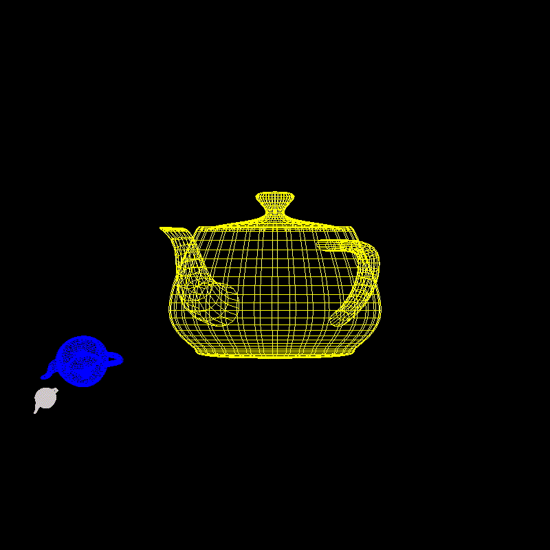

<h1 align='center'> Teapot Solar System </h1>

Inicialmente, este programa tratava-se de uma simulação simplificada do Sistema Solar (com o Sol, a Terra e a Lua) a fim de demonstrar como utilizar a função `glutTimerFunc` que é executada com uma frequência determinada a fim de gerar uma animação; a órbita dos corpos celestes. O objetivo era exemplificar para os alunos como poderia ser realizada a animação do Trabalho 2.
Com efeito, de forma leve e bem humorada, substituimos os corpos celestes por bules e assim surgiu o Sistema Solar de Bules,
também feito através da API gráfica OpenGL, em C.

## Como Executar

1. Instale o OpenGL. Para mais informações, clique [aqui](https://edisciplinas.usp.br/pluginfile.php/4264396/mod_resource/content/1/guia-de-instalacao.pdf)

2. Clone este repositório
```
git clone https://github.com/GustavoMartinx/computer-graphics.git
```

3. Entre no diretório `Teapot-Solar-System`
```
cd Teapot-Solar-System/
```

4. Compile com as bibliotecas e execute
```
gcc main.c -lGL -lglut -lGLU -o main && ./main
```

## :earth_americas: Preview do Teapot Solar System 



## :mortar_board: Autores

<table style="flex-wrap: wrap; display: flex; align-items: center;  flex-direction: column;" ><tr>


<td align="center"><a href="https://github.com/Fgarm">
 
<br />
 <b>Guilherme<br>Maturana</b></a>
 <a href="https://github.com/Fgarm" title="Repositorio Guilherme Maturana"></a>
</td>

<td align="center"><a href="https://github.com/GustavoMartinx">
 
<br />
 <b>Gustavo<br>Martins</b>
 </a> <a href="https://github.com/GustavoMartinx" title="Repositorio Gustavo Martins"></a>
</td>

<td align="center"><a href="https://github.com/RenanGAS">
 
<br />
 <b>Renan<br>Sakashita
</b>
 </a> <a href="https://github.com/RenanGAS" title="Repositorio Renan Sakashita"></a>

</td>

</tr></table>