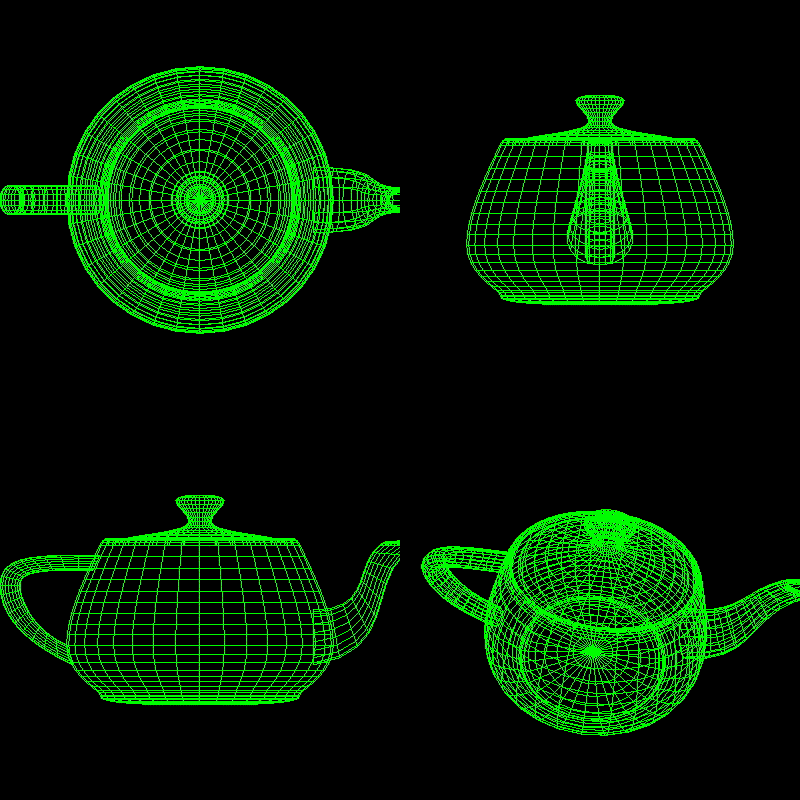

<h1 align='center'> Viewing 3D </h1>
Este trabalho consiste em dividir a janela do OpenGL quatro viewports, onde três projeções são ortogonais e uma (inferior direita) é perspectiva, cada uma com seu objeto 3D e sua câmera.
O objetivo é manipular as câmeras de acordo com especificações fornecidas ajustando configurações como sua posição, para onde está apontando, planos near e far, vetor view up.
Bem como os outros projetos deste repositório, este também foi desenvolvido por meio da API gráfica OpenGL, em C.


## Como Executar

1. Instale o OpenGL. Para mais informações, clique [aqui](https://edisciplinas.usp.br/pluginfile.php/4264396/mod_resource/content/1/guia-de-instalacao.pdf)

2. Clone este repositório
```
git clone https://github.com/GustavoMartinx/computer-graphics.git
```

3. Entre no diretório `trab2`
```
cd trab2/
```

4. Compile com as bibliotecas e execute
```
gcc main.c -lGL -lglut -lGLU -o main && ./main
```

## :camera: Preview do Projeto 2



## :mortar_board: Autores

<table style="flex-wrap: wrap; display: flex; align-items: center;  flex-direction: column;" ><tr>


<td align="center"><a href="https://github.com/Fgarm">
 
<br />
 <b>Guilherme<br>Maturana</b></a>
 <a href="https://github.com/Fgarm" title="Repositorio Guilherme Maturana"></a>
</td>

<td align="center"><a href="https://github.com/GustavoMartinx">
 
<br />
 <b>Gustavo<br>Martins</b>
 </a> <a href="https://github.com/GustavoMartinx" title="Repositorio Gustavo Martins"></a>
</td>

<td align="center"><a href="https://github.com/RenanGAS">
 
<br />
 <b>Renan<br>Sakashita
</b>
 </a> <a href="https://github.com/RenanGAS" title="Repositorio Renan Sakashita"></a>

</td>

</tr></table>